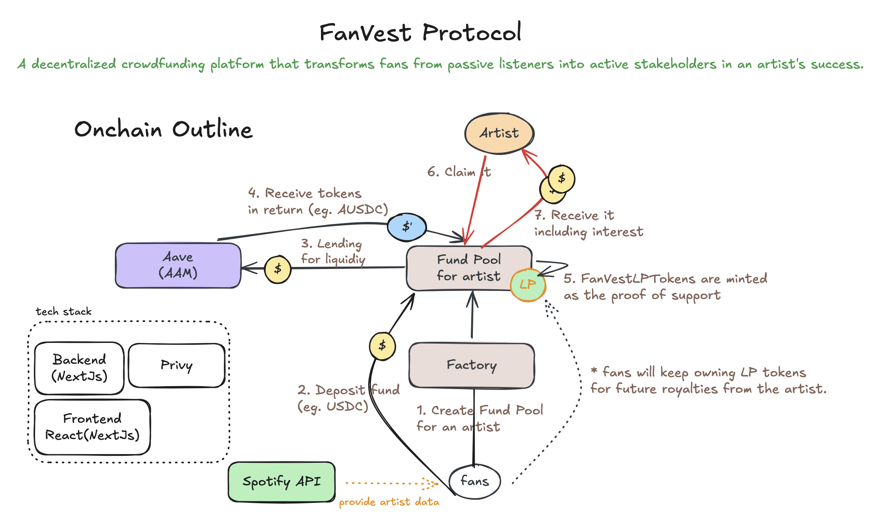

# FanVest Protocol

A decentralized crowdfunding platform that allows fans to collectively invest in their favorite musicians and share in their future success through tokenized streaming royalties.

## 🎵 Project Overview

FanVest is a decentralized crowdfunding platform that transforms fans from passive listeners into active stakeholders in an artist's success. We empower communities to collectively fund the artists they believe in, creating a new, transparent, and mutually beneficial economic model for the music industry

## 🏗️ Architecture



## How It Works:

**Fans Pool Capital**: 

Fans discover an indie artist on the platform and contribute stablecoins (like USDC) to their funding pool. In return, they receive Fan LP tokens, representing their share of the pool's assets.   

**DeFi-Powered Growth**: 

The pooled capital is automatically deposited into a trusted, low-risk DeFi lending protocol (like Aave) to earn interest. This allows the community's treasury to grow passively, creating a larger funding amount for the artist.   

**Funding the Artist**: 

Once the campaign goal is met, the artist claims the entire fund—both the principal contributions and the accrued interest—to finance their next album, tour, or project.   

**Sharing in the Success**: 

In exchange for the capital, the fan pool receives a tokenized share of the artist's future streaming royalties. As the artist's music generates revenue, those earnings are distributed back to the fans who hold the LP tokens, rewarding them for their early belief and investment.   

### Core Features

- **Artist Investment Pools**: Create dedicated funding pools for individual artists using Spotify integration
- **Fan LP Tokens**: Receive tokenized shares representing your stake in an artist's funding pool
- **DeFi Integration**: Automatic yield generation through Aave V3 lending protocol
- **Spotify Integration**: Discover and invest in artists from your personal playlists
- **Oracle Data**: Real-time artist metrics and popularity data from Spotify
- **Smart Contract Security**: Built on Ethereum with OpenZeppelin standards
- **Artist Claims**: Artists can claim pooled funds plus earned interest for their projects

## 🏗️ Structure

The project consists of three main components:

### 1. Smart Contracts (`/contract`)
- **FanVestFactory**: Central registry that deploys and manages artist pools
- **FanVestPool**: Individual artist investment pools with ERC-20 LP tokens
- **VerificationRegistry**: Artist verification system
- **Mock Contracts**: Testing utilities for USDC and Aave integration

### 2. Frontend Application (`/frontend`)
- **Next.js 15** with TypeScript and Tailwind CSS
- **Privy Authentication** with smart wallet integration
- **Spotify API Integration** for artist discovery and oracle data
- **Smart Contract Interaction** via Viem with custom hooks
- **Real-time Balance Tracking** and transaction management

### 3. Development Tools
- **Hardhat 3** for smart contract development and testing
- **TypeScript** throughout the entire stack
- **Viem** for Ethereum interactions

### Note

Please use AAVE token in Sepolia network, since other major tokens like USDC and USDT are not available as the the amount in the liquidity pool reaches to the cap limit.

You can get the faucet here: https://gho.aave.com/faucet/

## Artist Claim

Visit `artist/{artistIdFromSpotify}/claim` to claim the funds.

## 🚀 Quick Start

### Prerequisites
- Node.js 18+ and pnpm
- Git
- MetaMask or compatible wallet
- Spotify Developer Account (for frontend features)

### Installation

1. **Clone the repository**
   ```bash
   git clone <repository-url>
   cd spodi-fi
   ```

2. **Install dependencies**
   ```bash
   # Install contract dependencies
   cd contract
   pnpm install

   # Install frontend dependencies
   cd ../frontend
   pnpm install
   ```

3. **Set up environment variables**
   ```bash
   # Contract environment
   cp contract/.env.example contract/.env
   # Add your private keys and RPC URLs

   # Frontend environment
   cp frontend/.env.example frontend/.env.local
   # Add your Spotify API credentials and contract addresses
   ```

### Development

**Smart Contracts:**
```bash
cd contract
pnpm hardhat compile
pnpm hardhat ignition deploy ignition/modules/deploymentSepoliaV7.ts --network sepolia
```

**Frontend:**
```bash
cd frontend
pnpm dev
```

## 📋 How It Works

1. **Artist Discovery**: Connect your Spotify account to discover artists from your playlists
2. **Pool Creation**: Create or join existing funding pools for your favorite artists
3. **Investment**: Deposit USDC to receive Fan LP tokens representing your share
4. **Yield Generation**: Pooled funds automatically earn interest through Aave V3
5. **Artist Funding**: Artists can claim the total pool value (principal + interest)
6. **Shared Success**: Fans receive tokenized shares of future streaming royalties

## 🛠️ Technology Stack

### Smart Contracts
- **Solidity ^0.8.20**
- **OpenZeppelin Contracts**
- **Aave V3 Integration**
- **Hardhat 3 with Viem**

### Frontend
- **Next.js 15** with App Router
- **TypeScript**
- **Tailwind CSS**
- **Privy Authentication**
- **Viem for Ethereum interactions**

### Development
- **Hardhat 3 Beta**
- **Foundry** (compatible testing)
- **TypeScript** throughout
- **pnpm** package manager

## 📁 Project Structure

```
spodi-fi/
├── contract/                 # Smart contracts
│   ├── contracts/           # Solidity contracts
│   ├── test/               # Contract tests
│   ├── scripts/            # Deployment and utility scripts
│   └── ignition/           # Hardhat Ignition deployment modules
├── frontend/               # Next.js application
│   ├── src/
│   │   ├── app/           # App Router pages
│   │   ├── components/    # React components
│   │   ├── hooks/         # Custom React hooks
│   │   └── lib/           # Utility functions
│   └── public/            # Static assets
└── README.md              # This file
```

### Frontend Scripts
```bash
# Development server
pnpm dev

# Build for production
pnpm build

# Start production server
pnpm start
```

## 🌐 Network Support

- **Ethereum Sepolia** (testnet)
- **Local Hardhat Network** (development)

## 📄 License

This project is licensed under the MIT License - see the [LICENSE](LICENSE) file for details.

## 🤝 Contributing

1. Fork the repository
2. Create a feature branch (`git checkout -b feature/amazing-feature`)
3. Commit your changes (`git commit -m 'Add some amazing feature'`)
4. Push to the branch (`git push origin feature/amazing-feature`)
5. Open a Pull Request

## 📞 Support

For support and questions, please open an issue in the GitHub repository.